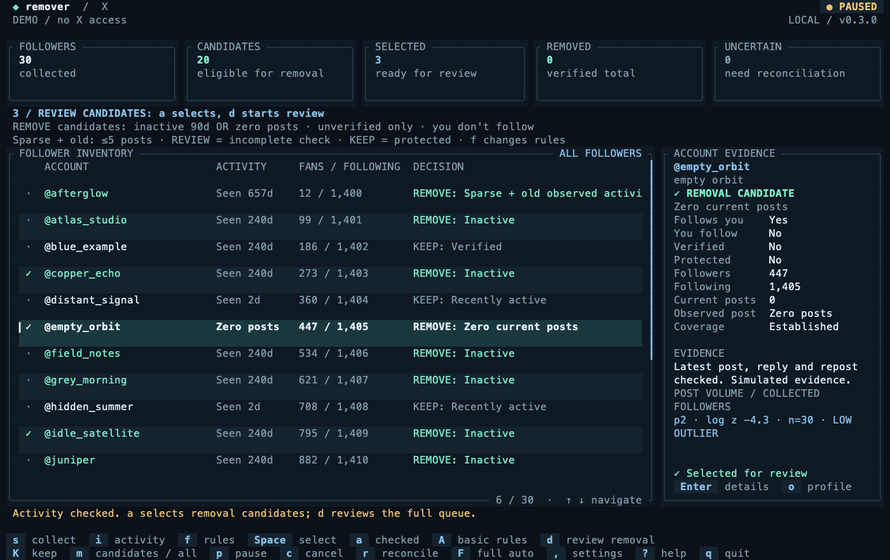

# forgive-me

Control who follows you on X.

## Why

Bought followers and unwanted accounts can leave you with a follower list you did not choose.
forgive-me helps you examine that list and remove unwanted followers.
You set the rules. You approve each removal batch.

## How

The app separates the work into three steps:

1. **Collect.** The Chrome extension reads your followers, the accounts you follow, and visible post activity.
2. **Review.** The terminal shows which accounts meet your rules and the reason for each result.
3. **Remove.** You approve a batch. The extension removes those followers, one account at a time.

X login data stays in Chrome. The app stores account data and progress on your computer.
If required data is unknown, the default rules exclude the account.
The app does not repeat a removal automatically after an uncertain result.

## What you can do

- Find inactive followers and accounts with no current posts.
- Exclude verified accounts and accounts you follow.
- Keep specific accounts, even when they meet your removal rules.
- Search the collected followers and examine account details.
- Approve removal batches, pause work, or cancel the remaining removals.
- See confirmed removals and results that need further examination.

The app has a fullscreen terminal interface and a Chrome extension.
It removes followers through X's `RemoveFollower` action.
The accounts you follow do not change.



## Install

Requirements:

- An Apple Silicon Mac.
- Chrome with access to your X account.
- The [GitHub CLI](https://cli.github.com/), signed in to an account with access to this private repository.

If you use Homebrew, install the GitHub CLI:

```sh
brew install gh
```

Sign in to GitHub:

```sh
gh auth login
```

Install forgive-me:

```sh
gh api repos/altonwells/forgive-me/contents/install.sh -H 'Accept: application/vnd.github.raw+json' | sh
```

The installer verifies the download checksum. It does not need `sudo`, Rust, Node, or Python.

Open a new terminal window. Start the app:

```sh
forgive-me
```

### Connect Chrome

Keep the terminal open during these steps.

1. Press Enter in the setup guide. The app opens Chrome and copies the extension folder path.
2. Enable **Developer mode** on Chrome's extension page.
3. Select **Load unpacked**.
4. Press **Cmd+Shift+G** in the folder selector.
5. Paste the copied path and select the folder.
6. The extension pairs with the terminal automatically.
7. Select **Open X** in the extension and sign in to your X account.
8. Check that the terminal shows the correct account.
9. Press Enter to open the follower list.

Chrome requires you to confirm the extension installation once.
You do not need to enter a port or pairing secret.
The extension folder is:

```text
~/.local/share/forgive-me/bundle/forgive-me-extension
```

If the extension is already installed, press `o` to open its setup page.
On the connection screen, Enter opens the extension and `i` opens install/reload.
The guide advances only when Chrome connects and X identifies your account.
Select **Connect automatically** if it does not connect.
**Shift+P** opens the terminal guide again.
Manual pairing remains available under **Manual connection and repair**.

## Remove unwanted followers

Keep Chrome and the terminal open during work.

1. Press `s` to start the scan.
2. Wait for the scan to finish.
3. Press `f` to examine the removal rules.
4. Press Enter to save the rules.
5. Press `m` to show accounts that meet the rules.
6. Press Enter on an account to examine its data.
7. Press Esc to return to the list.
8. Press `K` on each account you want to keep.
9. Press `a` to select the matches in the current view.
10. Press `d` to review the removal batch.
11. Press `y` only if you approve the removals.

**Enter, `n`, or Esc cancels the removal confirmation.**

### Default rules

An account must meet all these conditions:

- It follows you.
- You do not follow it.
- It is unverified, including blue verification.
- It is public.
- It is not on your keep list.
- Recent data shows no visible post activity within 90 days, or shows zero current posts.

Post activity includes posts, replies, and reposts. Inactivity does not prove that an account is a bot.
Zero current posts does not mean the account never posted.

The default batch limit is 50 accounts.
After a removal finishes, the app waits at least 10 seconds before it sends the next removal request.
Press `f` to change these settings.

## Controls

| Key | Action |
| --- | --- |
| ↑ / ↓, `j` / `k`, mouse wheel | Move through the list or scroll help and details |
| `s` | Start or continue a scan |
| `/` | Search collected followers |
| `m` | Switch between all followers and matches |
| Enter | Open account details |
| Space | Select or deselect one eligible account |
| `a` | Select matches in the current view |
| `K` | Add or remove a keep exception |
| `f` | Change the removal rules |
| `d` | Review a removal batch |
| `p` | Pause or continue work |
| `c` | Cancel the remaining removals |
| `r` | Resolve one uncertain result without another removal request |
| `o` | Open the account's X profile |
| **Shift+P** | Open the connection guide and pause work |
| `?` | Open help |
| `q` | Quit from the follower list or connection guide |
| **Ctrl-C** | Pause and quit from any screen |

The terminal keeps the header and controls in place. Lists scroll inside the app.
The minimum window size is 52 columns by 12 rows.

To try the interface with fictional accounts:

```sh
forgive-me --demo
```

The removal screen shows an animation and the confirmed removal count.
To disable the animation:

```sh
forgive-me --no-animation
```

## Update

1. Quit forgive-me.
2. Run the install command again.
3. Open `chrome://extensions`.
4. Select **Reload** on forgive-me. Accept the native messaging permission if Chrome asks.
5. Refresh your X tab.
6. Start forgive-me in the terminal.
7. Open the extension and select **Connect automatically**.

The update preserves your pairing settings, keep list, and action history.

## Limits and current status

X can change its web interface or restrict requests. The app can stop when this occurs.
A pause cannot stop a removal request that the extension has already sent.
There is no action to restore removed followers. A removed account can follow a public account again.

Version 0.1.6 passed automated, terminal, and installer tests.
The updated X integration still needs a new scan on a real account.
No real follower removal was used to test this release.
See the [test record](docs/VERIFICATION.md).

## Reference

- [Troubleshooting, data, and installation options](docs/GUIDE.md)
- [Build instructions and internal design](docs/DEVELOPMENT.md)
- [Browser protocol](protocol/README.md)
- [Release history](https://github.com/altonwells/forgive-me/releases)

[MIT license](LICENSE). [Third-party notices](THIRD_PARTY_NOTICES.md).
