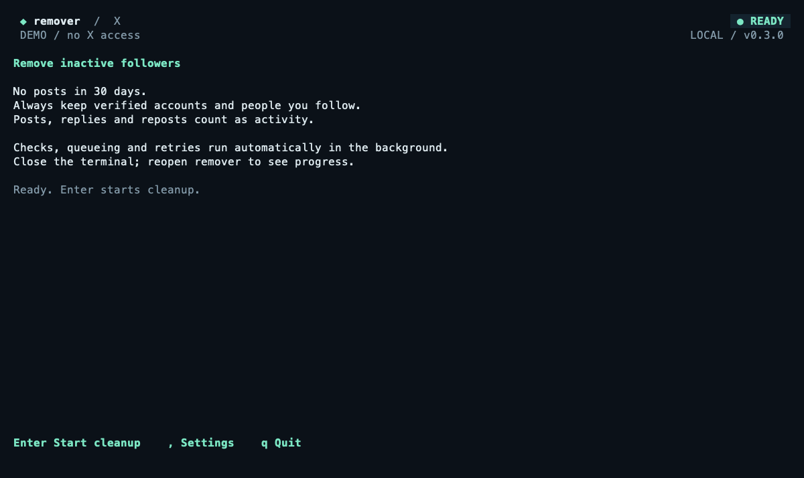
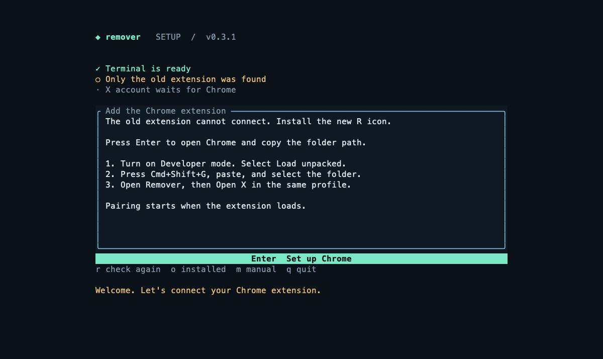
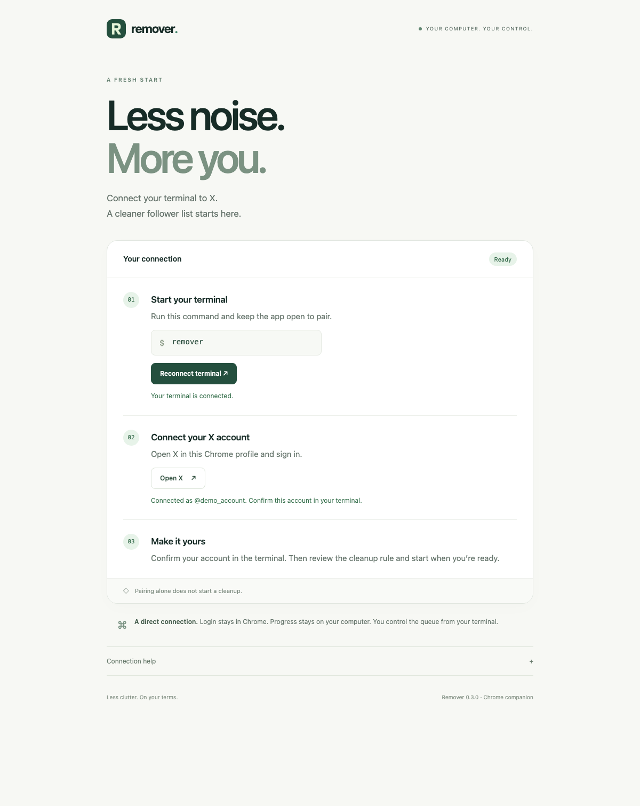
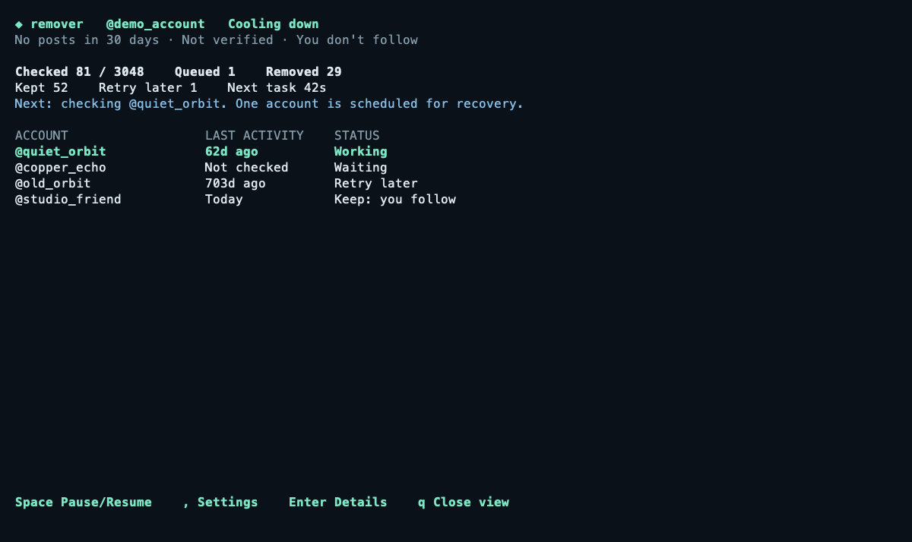

# Remove Bot Followers on X (Twitter)

Remove bot and fake followers from your X (Twitter) account. Free, open source. Detect bots, dry-run, bulk remove followers.

**Your follower list should be yours to manage.** Remover helps you clear inactive followers while keeping verified accounts and people you follow.

A local terminal app controls the work. A Chrome extension reads X through your signed-in account. Approve one cleanup pass, then let the saved queue run in the background.

[Install and set up](#install-and-set-up) · [Run a cleanup](#bulk-remove-followers) · [Rules](#bot-detection-rules) · [FAQ](#faq) · [Download](https://github.com/altonwells/x-bot-follower-remover/releases)



*Previews use fictional accounts. The `remover --demo` command makes no X requests. A dry-run against your real followers is not available.*

## Remove fake followers

Bought followers, fake accounts, and inactive followers can leave you with a list you no longer want. Remover gives you a clear rule and control over the work.

It checks each follower and removes an account only when **all three** conditions are met:

- No posts, replies, or reposts in the last **30 days**.
- **You do not follow** the account.
- The account is **not verified**.

These rules identify inactive followers, not proof that a person is a bot. If X does not return enough data, the account is set aside for a retry.

Login data stays in Chrome. Progress stays on your Mac. There is no hosted service or X API subscription to set up.

## Install and set up

You need an **Apple Silicon Mac**, **Google Chrome**, and an X account. No GitHub login is required.

### 1. Install Remover

Paste this command into Terminal:

```sh
curl -fsSL https://raw.githubusercontent.com/altonwells/x-bot-follower-remover/main/install.sh | sh
```

The installer checks the download checksum. It installs in your home folder without `sudo`, Rust, or Node.

### 2. Open the setup guide

```sh
remover
```

Keep the terminal open. Remover checks for the Chrome extension and shows the next step. An old pairing does not count as a live connection.



### 3. Add the Chrome extension

1. Press **Enter** in the setup guide. It opens Chrome's extension page and copies the correct folder path.
2. Turn on **Developer mode**. Select **Load unpacked**.
3. Press **Cmd+Shift+G**, paste the copied path, and select the folder.
4. Open **Remover**, the extension with the **R** icon. Its connection page pairs with the terminal automatically.

Chrome requires this manual installation step. You do not need to copy a pairing secret.

If you need the folder path:

```text
~/.local/share/remover/bundle/remover-extension
```

### 4. Connect your X account

Select **Open X** on the extension page. Sign in using the **same Chrome profile** where you installed Remover. Return to the terminal and confirm the account shown.



**Setup does not start removal.** The terminal shows the cleanup rule after the live account check succeeds.

If setup waits for Chrome, check that the R extension is enabled. Press **r** in the setup guide to check again. Chrome profile detection is a hint; only a live connection confirms that the extension is ready.

## Bulk remove followers

1. Run **`remover`** and finish setup.
2. Press **Enter** to review the cleanup pass.
3. Press **y** to approve it.

The worker collects followers, checks activity, queues matches, and removes them one at a time. It saves progress as it works. You can close the terminal and run `remover` later to see progress.



**Keep Chrome open, X signed in, and your Mac awake.** Work can continue over several days. It pauses while the Mac sleeps. In settings, you can turn on **Keep Mac awake** to prevent idle sleep; it does not guarantee operation with the lid closed.

| Control | Action |
| --- | --- |
| **Space** | Pause or resume the worker |
| **`,`** | Open processing settings |
| **Enter** | Show worker details |
| **q** | Close the view; keep the worker running |
| **c** | Cancel remaining work |
| **x** | Stop the worker and save progress |

You can also control it from another terminal:

```sh
remover status
remover pause
remover resume
remover stop
```

After a restart, run `remover` to restore a saved job. It does not start at login. A manual pause stays paused. A completed or cancelled pass needs new approval.

Removal reduces your follower count. It does not unfollow accounts you follow. There is no restore-followers action. A removed account can follow you again if your account is public.

### Processing speed

Press **`,`** to open settings. Use **↑/↓** to choose a field and **←/→** to change it. **Enter** saves. **Shift+R** restores the starting settings.

| Setting | Starting value |
| --- | --- |
| Time between removals | 60 seconds |
| Attempts per batch | 20 |
| Rest between batches | 5 minutes |
| Hourly attempt limit | 50 |
| Keep Mac awake | Off |

X response limits can add longer waits. Current cooldowns finish before new speed settings take effect. These settings are local controls, not X quotas or a guaranteed completion time.

## Bot detection rules

The standard pass uses the **30-day inactivity rule**, plus protection for verified accounts and people you follow. Accounts marked to keep remain protected.

Posts, replies, and reposts count as activity. Likes do not. A zero-post account must be at least 30 days old. A suspicious username or a low post count alone does not authorize removal.

Activity results are saved and reused at removal. The extension checks the signed-in identity, verification, and following relationship before it removes an account. A post made after the saved activity check may remain undetected.

Unreadable results are retried after 1 minute, 15 minutes, and 6 hours. After four failures, the account is set aside for a later pass. Other accounts continue. If a removal result is uncertain, the worker checks the follower relationship before another attempt.

## Update Remover

Stop the worker before updating:

```sh
remover stop
```

Run the install command again. Reload the R extension at `chrome://extensions`, then run `remover`.

**Moving from `forgive-me`?** Stop the old worker with `forgive-me stop`. Load the new extension folder shown above and disable the old extension. Remover repairs the old default pairing automatically and keeps your saved data. Do not delete the old data folder. A custom installation may need `remover pair --reset` while the app is closed.

## Why bots follow you

Spam operators may follow accounts to attract attention, make accounts look active, or inflate follower counts. X describes fake engagement and coordinated account abuse in its [authenticity policy](https://help.x.com/en/rules-and-policies/authenticity).

A quiet timeline does not prove that an account is fake. Remover helps you apply a clear follower cleanup rule instead of guessing from a username.

## FAQ

**Does X notify the removed follower?**

Remover sends no message. X documents [removing a follower](https://help.x.com/en/using-x/following-faqs), but that page does not promise a notification policy for removal. The person can still notice the change or follow you again.

**Can I bulk remove followers?**

Yes. Approve one pass. Remover queues matching followers and removes them individually. You can pause, resume, or stop the queue.

**Is it safe? Will I hit rate limits?**

Rate limits and account restrictions are possible. There is no guaranteed safe daily allowance. Remover spaces requests, rests between batches, and waits when X reports limits. Those controls do not override [X's automation rules](https://help.x.com/en/rules-and-policies/x-automation).

**Does it work on mobile?**

No. This release needs an Apple Silicon Mac and desktop Google Chrome.

**Can I try it without removing followers?**

Run `remover --demo` to explore the interface with fictional accounts. It makes no X requests. This is not a dry-run against your real follower list. Pairing alone does not approve removal.

**Can it run while the terminal is closed?**

Yes. The worker continues after you close the terminal. Keep Chrome signed in and the Mac awake. Run `remover` again to see progress.

## Compared to other tools

These are documented approaches, not a live reliability test. X compatibility can change.

| Tool | Approach | Main difference |
| --- | --- | --- |
| [xbotremover](https://github.com/vanrohan/xbotremover) | Browser extension with adjustable rules | Documents live dry-run support and Chrome/Firefox builds |
| [x-bot-sweeper](https://github.com/sleeyax/x-bot-sweeper) | Semi-automatic identification and blocking | Archived; maintainer cites changing X endpoints |
| [x-bot-cleaner](https://github.com/iuzn/x-bot-cleaner) | Mark accounts Real/Bot, then bulk remove | Classification happens in the browser |
| x-follower-cleaner, the earlier local [X-Cleaner](https://github.com/taqui-786/X-Cleaner---Followers-Following) fork | Browser-side follower and following cleanup | Earlier extension approach before this terminal and worker |
| **[Remover](https://github.com/altonwells/x-bot-follower-remover)** | **Terminal + Chrome extension + saved local queue** | **One 30-day rule, background progress, retries, and pause controls** |

## Free and open source

Remover is public under the **[MIT license](LICENSE)**.

[Build guide](docs/DEVELOPMENT.md) · [Operation guide](docs/GUIDE.md) · [Verification record](docs/VERIFICATION.md) · [Protocol](protocol/README.md)

Automated tests use synthetic X responses and isolated workers. They do not establish live reliability over multiple days.
