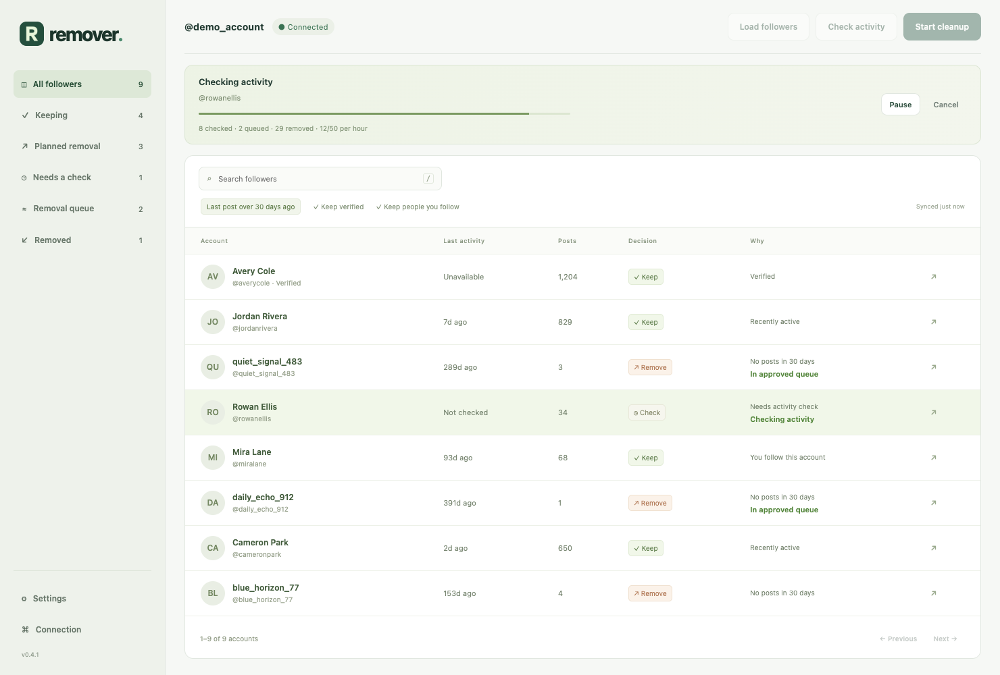
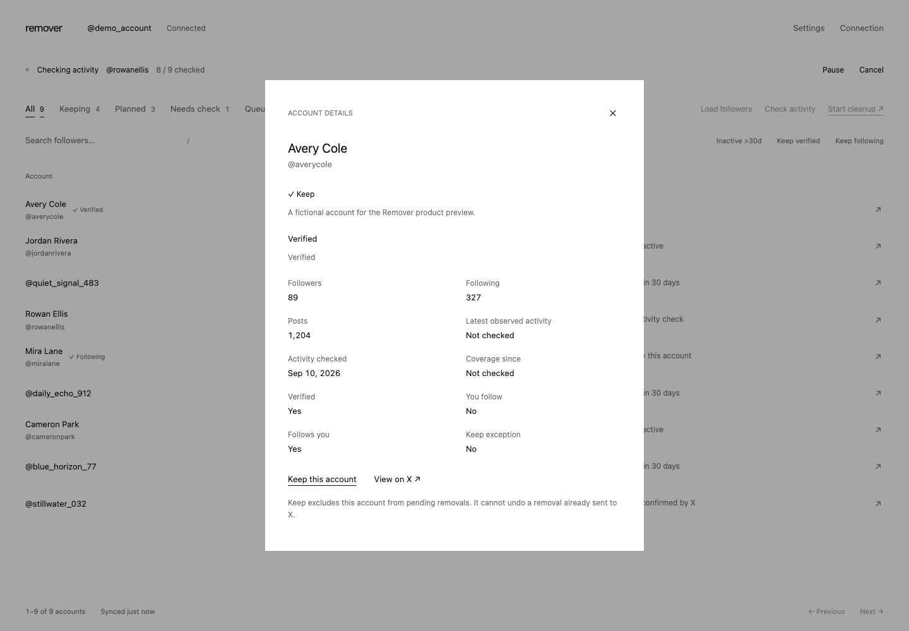
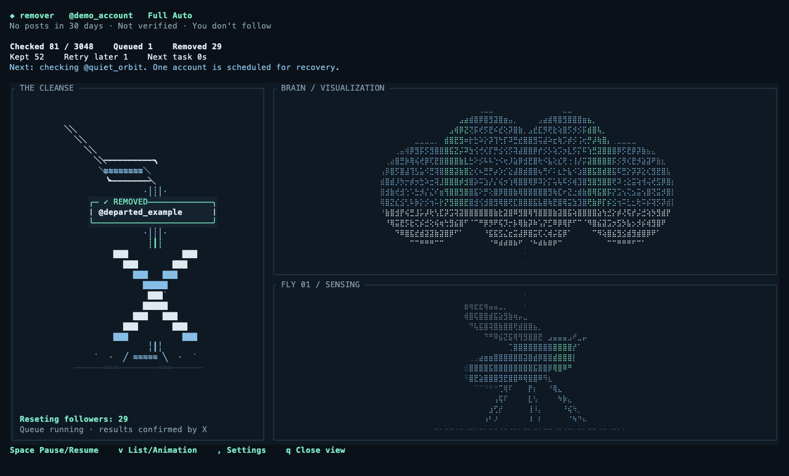

# Remove Bot Followers on X (Twitter)

Remove bot and fake followers from your X (Twitter) account. Free, open source. Detect bots, dry-run, bulk remove followers.

You should control who follows you. Remover helps you remove inactive followers and keep the accounts you value.

Review your followers in one table. See the last post, account counts, and the reason for each decision. Approve a cleanup, then let the saved queue run on your Mac.

**Chrome does the X work. The local worker saves progress. You control both from the browser or terminal.** No hosted service or paid X API subscription is required.

[Install](#install-and-set-up) · [Preview](#preview-before-removal) · [Bulk remove](#bulk-remove-followers) · [Rules](#bot-detection-rules) · [FAQ](#faq) · [Releases](https://github.com/altonwells/x-bot-follower-remover/releases)



*Screenshots show the current main branch with fictional accounts. The installer downloads the latest published release, which can differ from main.*

## Remove fake followers

Use Remover to clean a follower list that contains bought followers, suspected bots, or inactive accounts. The standard cleanup removes a follower only when all three rules pass:

| Rule | Required result |
| --- | --- |
| Last visible post | At least 30 days old, or no posts on an account at least 30 days old |
| You follow the account | No |
| Account is verified | No |

Accounts you mark **Keep** and protected accounts are also excluded. Missing information does not count as a match.

These are inactivity rules, not proof that an account is a bot. Removal reduces your follower count. It does not unfollow people you follow.

## Install and set up

You need an **Apple Silicon Mac**, **Google Chrome**, and an X account. The installer needs no `sudo`, GitHub login, Rust, or Node.

### 1. Install

Paste this command into Terminal:

```sh
curl -fsSL https://raw.githubusercontent.com/altonwells/x-bot-follower-remover/main/install.sh | sh
```

The installer checks the download checksum and installs Remover in your home folder.

### 2. Start Remover

```sh
remover
```

Keep the terminal open. The setup guide checks the extension and your X connection.

### 3. Add the Chrome extension

1. Press **Enter** in the setup guide. Remover opens Finder and Chrome's extension manager, then copies the extension folder path.
2. In Chrome, turn on **Developer mode** and select **Load unpacked**.
3. Press **Cmd+Shift+G**, paste the path, and select the folder.
4. Open the **R extension** from Chrome's toolbar. Select **Connection** to check pairing.

Chrome requires the **Load unpacked** step. Pairing is automatic; you do not need to copy a secret.

Extension folder:

```text
~/.local/share/remover/bundle/remover-extension
```

### 4. Connect X

In **Connection**, select **Open X**. Sign in with the same Chrome profile that has the extension. Return to the terminal and confirm the account shown.

**Setup does not remove anyone.** If the extension is not detected, check that it is enabled and press **r** in the terminal to retry. See the [connection guide](docs/GUIDE.md#if-the-extension-does-not-connect) for help.

<details>
<summary>Setup screenshots</summary>


</details>

## Preview before removal

Open the **R extension**. Keep `remover` open during these manual steps:

1. Select **Load followers**.
2. When collection finishes, select **Check activity**.
3. Use the filters above the table to review the results. Open an account's details to select **Keep this account**.

This is the live dry-run workflow: it reads your followers and checks activity without approving removal.

| Filter | What it shows |
| --- | --- |
| All | Saved accounts, including confirmed removals |
| Keeping | Accounts excluded by a rule or your Keep choice |
| Planned | Accounts that pass the removal rules |
| Needs check | Accounts with missing information or an unresolved result |
| Queued | Accounts waiting in the approved removal queue |
| Removed | Accounts whose removal was confirmed |

The work indicator shows the current action or cooldown. Numeric cells use compact values; hover to see exact counts. Open account details to inspect the saved evidence.

<details>
<summary>Account details and Keep control</summary>



</details>

To explore with fictional accounts and no X requests:

```sh
remover --demo
```

## Bulk remove followers

Select **Start cleanup** in Chrome and approve the account and rule shown. In the terminal, press **Enter**, then **y**.

One approval starts a full pass. Remover collects followers, checks activity, and removes matching accounts one at a time. Your Keep choices stay in effect. Progress is saved after each step.

**Keep Chrome open, X signed in, and your Mac awake.** You can close the terminal. Run `remover` again to see progress. In **Settings**, enable **Keep Mac awake** for long runs; this prevents idle sleep but does not guarantee operation with the lid closed.



| Terminal key | Action |
| --- | --- |
| **Space** | Pause or resume |
| **`,`** | Change processing settings |
| **v** or **Tab** | Switch between the list and animation |
| **Enter** | Show worker details |
| **q** | Close the view; keep the worker running |
| **c** | Cancel remaining work |
| **x** | Stop the worker and save progress |

You can also use another terminal:

```sh
remover status
remover pause
remover resume
remover stop
```

After a computer restart, run `remover` to restore the saved job. It does not start at login. A manual pause stays paused. A completed or cancelled pass needs new approval.

### Processing settings

Select **Settings** in Chrome or press **`,`** in the terminal.

| Setting | Default |
| --- | ---: |
| Time between removals | 60 seconds |
| Attempts per batch | 20 |
| Rest between batches | 5 minutes |
| Hourly attempt limit | 50 |
| Keep Mac awake | Off |

X can require longer waits. Existing cooldowns finish before new settings take effect. These are local limits, not an X allowance or a promised completion time.

### Advanced terminal mode

```sh
remover --advanced
```

Use the full inventory, evidence panel, manual selection, and custom rules. Press **?** for controls. Before a background job starts, **Tab** switches simple and advanced views.

During a job, **v** switches the list and animation. The ladle pours over X beside a dot-rendered brain and fruit fly. The fly walks during collection, senses during checks, and rests during cooldowns. A confirmed removal triggers a brain pulse, wing movement, and a falling account tag. Pause stops motion.

The brain and fly are a visualization of queue activity, not a biological simulation or a bot classifier. The full scene fits terminals at least 112 columns wide with enough height; smaller windows retain the ladle view. Use `--no-animation` for a still view, or `REMOVER_ASCII=1 remover` if your terminal does not display Braille dots.

Full Auto uses the fixed 30-day rule. Custom advanced rules apply to manual selection.

## Bot detection rules

Remover reads the top of the Posts timeline and uses the newest valid post date returned by X. It does not scan full history or require separate replies and reposts checks. If that timeline returns no usable date, it tries the combined posts/replies timeline once.

An old pinned post alone does not qualify. A suspicious username or a low post count alone does not qualify. Zero-post accounts must be at least 30 days old.

Saved activity results are reused for removal. The extension checks account identity, verification, and the following relationship before it acts. A new post made after the saved check can remain undetected.

If information is unavailable, Remover schedules retries and continues with other accounts. If a removal result is uncertain, it checks the follower relationship before another attempt. See the [operation guide](docs/GUIDE.md) for retry timing and recovery.

## Update Remover

1. Run `remover stop`.
2. Run the install command again.
3. Open `chrome://extensions` and reload the R extension.
4. Run `remover`.

Saved progress and Keep choices are retained. For source builds, see the [build guide](docs/DEVELOPMENT.md).

<details>
<summary>Moving from forgive-me</summary>

Stop the old worker with `forgive-me stop`. Load the new extension folder shown above and disable the old extension. Remover repairs the default pairing and keeps saved data. Do not delete the old data folder. A custom installation may need `remover pair --reset` while the app is closed.

</details>

## Why bots follow you

Spam accounts can follow people to attract attention or inflate engagement. X describes fake engagement and account abuse in its [authenticity policy](https://help.x.com/en/rules-and-policies/authenticity).

An inactive account can also belong to a real person. Review the rules and mark accounts to keep before you approve a cleanup.

## FAQ

### Does X notify the removed follower?

Remover sends no message. [X's follower removal guide](https://help.x.com/en/using-x/following-faqs) does not state a notification guarantee. The person can notice the change and can follow you again if your account is public.

### Can I bulk remove followers?

Yes. Approve a pass to queue matching followers and remove them individually. Pause, resume, or cancel the remaining work at any time.

### Is it safe? Will I hit rate limits?

Rate limits and account restrictions are possible. [X's automation rules](https://help.x.com/en/rules-and-policies/x-automation) prohibit non-API website automation and warn of suspension. Remover uses your browser session. Delays and cooldowns do not guarantee account safety or policy compliance.

### Does it work on mobile?

No. The published installer requires an Apple Silicon Mac and desktop Google Chrome.

### Can I undo a removal?

No. Remover has no restore-followers action. Marking an account **Keep** excludes pending work; it cannot undo a removal already sent to X.

### Can it run for several days?

Yes, while the local worker runs, Chrome stays signed in, and your Mac stays awake. The queue saves progress and waits through cooldowns. X changes or access failures can interrupt a job.

## Compared to other tools

These summaries describe each project's documented approach. They are not a live reliability ranking. Links checked on September 10, 2026.

| Tool | Approach |
| --- | --- |
| [xbotremover](https://github.com/vanrohan/xbotremover) | Adjustable browser rules, dry-run preview, Chrome and Firefox builds |
| [x-bot-sweeper](https://github.com/sleeyax/x-bot-sweeper) | Identify and block suspected bots; repository archived |
| [x-bot-cleaner](https://github.com/iuzn/x-bot-cleaner) | Mark followers Real or Bot, then bulk remove in Chrome |
| [x-follower-cleaner / X-Cleaner](https://github.com/taqui-786/X-Cleaner---Followers-Following) | Follower removal and unfollow modes; the earlier local x-follower-cleaner fork used this base |
| [Remover](https://github.com/altonwells/x-bot-follower-remover) | One follower table, terminal controls, a 30-day auto rule, and a saved background queue |

## Free and open source

Remover is released under the [MIT license](LICENSE). The terminal uses Rust and Ratatui. The Chrome extension uses TypeScript.

[Build guide](docs/DEVELOPMENT.md) · [Operation guide](docs/GUIDE.md) · [Verification record](docs/VERIFICATION.md) · [Report an issue](https://github.com/altonwells/x-bot-follower-remover/issues)
