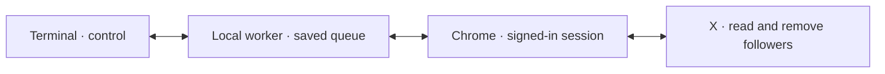

# Remove Bot Followers on X (Twitter)

Remove bot and fake followers from your X (Twitter) account. Free, open source. Detect bots, dry-run, bulk remove followers.

**Remover** · A local terminal app and Chrome companion. One rule. A queue you can leave running.

[Install](#install) · [How it works](#remove-fake-followers) · [Rules](#bot-detection-rules) · [FAQ](#faq) · [Releases](https://github.com/altonwells/x-bot-follower-remover/releases)


*Product previews use fictional accounts. The current preview command, `remover --demo`, makes no X requests. A live-account `--dry-run` command is not available. The code is MIT licensed; downloads currently require access to the private repository.*

## Remove fake followers

Your follower list should be yours to manage. Remover helps remove inactive accounts without removing verified accounts or people you follow.

Chrome reads X through your signed-in session. A local worker checks each follower, saves the result, and queues accounts that match your approved rule. The terminal shows progress and lets you pause, resume, or stop.



Login data stays in Chrome. Progress stays in a local SQLite database. There is no hosted service to configure.

## Install

The prebuilt release supports **Apple Silicon macOS** with **Google Chrome**. The private-release installer requires the [GitHub CLI](https://cli.github.com/) and repository access.

```sh
brew install gh
gh auth login
gh api repos/altonwells/x-bot-follower-remover/contents/install.sh -H 'Accept: application/vnd.github.raw+json' | sh
```

Open a terminal and run:

```sh
remover
```

The installer checks the release checksum and installs into your home folder. It does not need `sudo`, Rust, Node, or Python.

**Connect Chrome once**

1. Keep `remover` open. Press Enter in the setup guide.
2. In Chrome, enable **Developer mode**, then select **Load unpacked**.
3. Press **Cmd+Shift+G**, paste the folder path copied by the guide, and select it.
4. Open the extension's connection page. It pairs automatically with your terminal.
5. Select **Open X**, sign in, and confirm the correct account in the terminal.

Chrome requires you to approve the unpacked extension installation. Automatic pairing does not require copying a secret.

```text
~/.local/share/remover/bundle/remover-extension
```


*The connection preview uses a fictional account. Pairing alone does not start cleanup.*

## Bulk remove followers

Run `remover`, confirm your account, then press **Enter** and **y** to approve a cleanup pass.

The worker collects followers, checks activity, and removes matches one at a time. It starts in the background. Close the terminal and run `remover` later to see progress.


Keep Chrome open and signed in. Keep the Mac awake. A saved queue can continue over multiple days, but it cannot process requests while the computer sleeps.

Removal uses X's `RemoveFollower` action. It reduces your followers; it does not unfollow accounts you follow. Removed accounts can follow a public account again. There is no restore-followers action.

## Bot detection rules

Remove an account only when **all three** are true:

| Rule | Meaning |
| --- | --- |
| Inactive for 30 days | No recent posts, replies, or reposts in the checked activity |
| You do not follow them | Accounts you follow remain protected |
| They are not verified | Verified accounts remain protected |

Likes do not count as posting activity. A zero-post account must be at least 30 days old. Keep exceptions remain protected. Unreadable results are retried; they do not count as inactivity.

These are cleanup rules, not proof that someone is a bot. Usernames, low post counts, and statistical scores do not authorize removal in this workflow.

The queue reuses its saved activity result. It does not fetch activity timelines again at removal. It checks the signed-in identity, verification, and following relationship before writing. Posts made after the saved check may remain undetected.

## Controls

| Key | Action |
| --- | --- |
| Enter on the start screen | Review and start cleanup |
| Space in the worker view | Pause or resume |
| `,` | Processing settings |
| Enter in the worker view | Details |
| `q` in the worker view | Close the view; keep working |
| `c` | Cancel remaining work |
| `x` | Stop the worker and save progress |

After a pass completes or is cancelled, Enter can approve another pass.
Older approved queues retain their old rules and controls until finished or cancelled.
`remover --demo` retains the fictional inventory and pouring-animation preview.

## Processing settings

Choose a field with ↑/↓ and change it with ←/→. Enter or Esc saves.
Shift+R restores the recommended starting configuration:

| Setting | Starting value |
| --- | --- |
| Removal interval | 60 seconds |
| Attempts per batch | 20 |
| Rest between batches | 5 minutes |
| Hourly attempt limit | 50 |
| Keep Mac awake | Off; enable when wanted |

Settings apply to the current job without changing its removal rule.
Active cooldowns finish first. X response limits can extend the wait.
These are local defaults, not X quotas or a completion guarantee.
Read requests in the new flow are spaced by at least one second; endpoint backoff can increase that interval.

## Background work and recovery

Progress, retry deadlines, batch rests, and removal receipts survive restarts.
A normal Chrome reconnect resumes the same approved account. A manual pause stays paused.
After restarting the Mac or worker, run `remover` to restore the saved job. Automatic launch at login is not configured.
No requests run while the Mac sleeps. The optional awake setting prevents idle sleep while the job runs; it does not guarantee operation with the lid closed.

Unreadable accounts are retried after 1 minute, 15 minutes, and 6 hours. After four failures they remain set aside for a later pass.
Other accounts continue. Uncertain removals are recorded, then checked through the follower relationship before that target can be retried.
An absent follower closes the old attempt. A present follower can receive a bounded new attempt under the approved rule. Unresolved writes are never blindly repeated.
Login failures, account changes, and access denials pause the job.

```sh
remover status
remover pause
remover resume
remover stop
```

## Update

Run the install command again, reload the extension in `chrome://extensions`, and restart the terminal app. Stop a running worker with `remover stop` before updating.

**Upgrading from the former name:** stop the old worker with `forgive-me stop`. The new command is `remover`. Load the new extension folder above, then disable the old extension. Because Chrome derives an unpacked extension's identity from its folder, run `remover pair --reset` with the app closed, then reopen `remover` to pair.

Existing cleanup data stays in its original `forgive-me` data directory when present. The app reuses the same database and process lock. Fresh installs use `remover`. Do not delete the old data folder.

## Why bots follow you

Spam operators may follow accounts to attract attention, make accounts appear active, or inflate follower counts. X describes fake engagement and coordinated account abuse in its [authenticity policy](https://help.x.com/en/rules-and-policies/authenticity).

A follower's motive cannot be established from a username or a quiet timeline. Remover applies your stated cleanup rule and keeps the evidence visible.

## FAQ

**Does X notify the removed follower?**

Remover sends no message to the account. X documents [removing a follower](https://help.x.com/en/using-x/following-faqs), but that page does not promise a notification policy for removal. A person can still notice the changed relationship or follow you again.

**Can I bulk remove?**

Yes. Approve a pass once. The worker queues matching accounts and processes them individually, with saved progress and pause controls.

**Is it safe / will I hit rate limits?**

Rate limits and account restrictions are possible. There is no ban immunity or guaranteed daily allowance. Local pacing, batch rests, and response-based cooldowns reduce request pressure; they do not override X's limits. Start with the recommended configuration. See [X's automation rules](https://help.x.com/en/rules-and-policies/x-automation).

**Does it work on mobile?**

No. This release needs an Apple Silicon Mac and desktop Chrome. There is no mobile controller or hosted worker.

**Can I preview without removing anyone?**

`remover --demo` shows fictional accounts and makes no X requests. It is not a live-account dry run. Pairing and viewing setup do not approve removal; starting a cleanup pass does.

## Compared to other tools

This table describes documented approaches, not a live reliability benchmark. Project status and X compatibility can change.

| Tool | Approach | Main distinction |
| --- | --- | --- |
| [xbotremover](https://github.com/vanrohan/xbotremover) | Browser extension with adjustable rules | Documents live dry-run support and Chrome/Firefox builds |
| [x-bot-sweeper](https://github.com/sleeyax/x-bot-sweeper) | Semi-automatic identification and blocking | Repository archived; maintainer cites changing X endpoints |
| [x-bot-cleaner](https://github.com/iuzn/x-bot-cleaner) | Manually mark accounts Real/Bot, then bulk remove | Classification happens in the browser |
| x-follower-cleaner — earlier local fork of [X-Cleaner](https://github.com/taqui-786/X-Cleaner---Followers-Following) | Browser-side follower/following cleanup | The earlier extension approach, before this terminal and worker implementation |
| **[This project](https://github.com/altonwells/x-bot-follower-remover)** | **`remover` terminal + Chrome + saved local queue** | **One 30-day rule; background progress, retry recovery, and processing controls** |

## Development and license

[Build guide](docs/DEVELOPMENT.md) · [Operation guide](docs/GUIDE.md) · [Verification record](docs/VERIFICATION.md) · [Protocol](protocol/README.md) · [Changelog](CHANGELOG.md)

Automated checks use synthetic X responses and isolated local workers. These checks do not establish live multi-day reliability.

[MIT license](LICENSE). [Third-party notices](THIRD_PARTY_NOTICES.md).
